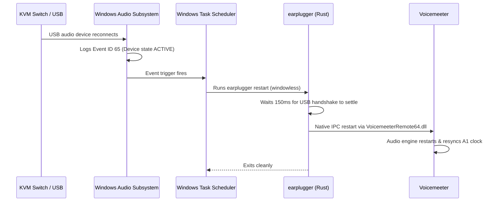

# earplugger

> [!NOTE]
> **Disclaimer:** This project was created and written by an AI / Large Language Model (LLM). While built and tested for reliability, please review the code and configuration before deploying in your environment.

Automatically restarts the Voicemeeter audio engine when a USB audio device or KVM switch reconnects on Windows.

[](LICENSE)
[](#)
[](https://www.rust-lang.org/)
[](https://github.com/johnathangallagher/earplugger/releases/latest)

---

## Why this exists

When using **Voicemeeter** (Standard, Banana, or Potato) with a **KVM switch**, USB audio switch, or hotpluggable DAC/headset:

1. Voicemeeter locks its master clock and mixing bus to the device configured under **Hardware Output A1**.
2. Switching the KVM disconnects the USB device, invalidating the active audio stream.
3. Switching back reconnects the device, but Voicemeeter often fails to re-acquire the stream cleanly—leaving the audio distorted, crackling, or completely silent.
4. The usual fix is manually opening Voicemeeter and hitting `Menu -> Restart Audio Engine` (`Ctrl + R`) every time.

`earplugger` automates this. It listens for the Windows device reconnection event, waits a moment for the USB handshake to settle, and sends a restart signal directly to Voicemeeter via its native API.

No background processes. No system tray clutter. 0 MB RAM and 0% CPU when idle.

---

## How it works



1. **Event trigger:** Subscribes to `Microsoft-Windows-Audio/Operational` Event ID 65 via Windows Task Scheduler.
2. **Device filter:** Triggers only when your specific audio output device transitions to active.
3. **Handshake debounce:** Pauses for a configurable 150ms so Windows audio drivers finish enumerating before restarting the engine.
4. **Native IPC:** Connects directly to Voicemeeter's shared memory API (`VoicemeeterRemote64.dll` or `VoicemeeterRemote.dll`), sets `Command.Restart = 1.0`, confirms the command was received, and unloads.

---

## Installation

### 1. Download or Build

- **Prebuilt binary:** Download `earplugger.exe` or the release archive from [Releases](https://github.com/johnathangallagher/earplugger/releases/latest).
- **From source:**
  ```bash
  git clone https://github.com/johnathangallagher/earplugger.git
  cd earplugger
  cargo build --release
  ```

### 2. Register the Task

Open an **Administrator** terminal and run:

```powershell
earplugger.exe install
```

This will:
- Auto-detect your currently running Voicemeeter instance and active **Hardware A1 device**.
- Enable the Windows Audio operational event log channel (`wevtutil sl Microsoft-Windows-Audio/Operational /e:true`).
- Register the `Earplugger_AutoRestart` event trigger in Windows Task Scheduler.

If you downloaded the release ZIP, you can also right-click `src\install.bat` and select **Run as administrator**.

#### Custom Options

```powershell
# Specify a device name manually (if Voicemeeter isn't running during install):
earplugger.exe install --device "RODE NT-USB"

# Change the post-reconnect settling delay (default 150ms, max 30000ms):
earplugger.exe install --delay-ms 250

# Bind the task to a specific user account:
earplugger.exe install --user "DOMAIN\User"
```

### 3. Verify

Check that the scheduled task and Voicemeeter connection are ready:

```powershell
earplugger.exe status
```

---

## CLI Reference

```text
Usage: earplugger <COMMAND> [OPTIONS]

Commands:
  restart              Wait for device settle and restart Voicemeeter engine (default)
  install              Register the Windows Task Scheduler event trigger
  uninstall            Remove the Windows Task Scheduler event trigger
  status               Check status of task trigger and Voicemeeter engine
  version              Print version information (--version, -v, -V)
  help                 Print this message

Options for 'restart':
  --delay-ms <MS>      Settling delay in milliseconds before restart (default: 150, max: 30000)
  --silent             Suppress interactive output (used by Task Scheduler)

Options for 'install':
  --device <NAME>      Audio device name filter. If omitted, auto-detects A1 from Voicemeeter.
  --delay-ms <MS>      Settling delay in milliseconds to configure in the trigger (default: 150)
  --user <USERNAME>    Target user for scheduled task (e.g. DOMAIN\User)

Options for 'uninstall':
  --disable-channel    Also disable the Microsoft-Windows-Audio/Operational event channel
```

---

## Uninstallation

To remove the scheduled task:

```powershell
earplugger.exe uninstall
```

Or right-click `src\uninstall.bat` and select **Run as administrator**.

To also turn off the Windows Audio operational event channel:

```powershell
earplugger.exe uninstall --disable-channel
```

---

## Building & Testing

Requires Rust 1.85.0+ (Edition 2024).

```bash
cargo test
cargo build --release
```

---

## License

Licensed under the [PolyForm Noncommercial License 1.0.0](LICENSE).
