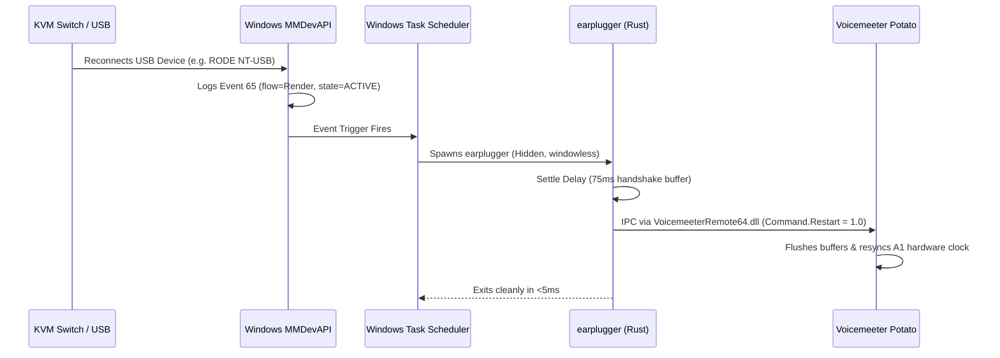

# 🔌 earplugger

> [!NOTE]
> **Disclaimer:** This project was created and written by an AI / Large Language Model (LLM). While built and tested for reliability, please review the code and configuration before deploying in your environment.

> **Zero-overhead, sub-quarter-second Voicemeeter auto-resynchronizer for KVM switches and USB audio disconnects.**

[](LICENSE)
[](#)
[](https://www.rust-lang.org/)
[](https://github.com/johnathangallagher/earplugger/releases/latest)

---

### The Problem: Why KVM Switches Murder Voicemeeter

If you use **Voicemeeter** (Standard, Banana, or Potato) alongside a **KVM switch**, USB audio switch, or hotpluggable DAC/headset, you know the pain:

1. **Master Clock Invalidation:** Voicemeeter synchronizes its internal audio clock and mixing bus to the **Hardware Output A1** device.
2. **Physical Sever:** When you switch your KVM away, the USB connection is severed. Windows logs a surprise removal (`CM_PROB_PHANTOM`), invalidating the active WASAPI/WDM audio stream.
3. **Buffer Desync:** When you switch back, Windows re-enumerates the audio endpoint, but **Voicemeeter does not automatically re-acquire the stream cleanly**. Its internal mixing buffers overflow and drift out of phase with the hardware clock, producing horrible robotic distortion, crackling, or complete silence.
4. **Manual Annoyance:** The only fix is manually opening Voicemeeter and hitting `Menu -> Restart Audio Engine` (`Ctrl + R`) every single time you switch PCs.

---

### Why Existing Solutions Fall Short

| Approach | Latency | Overhead | Failure Mode |
| :--- | :--- | :--- | :--- |
| **Voicemeeter Built-in "Auto Restart"** | N/A | Integrated | **Critical Loop:** Enters an infinite restart loop ("flashing red" indicator) while the KVM is switched away, chewing CPU and spamming the driver stack. Frequently hangs on return. |
| **Community Polling Scripts** (e.g. Python `sleep(5)`) | Up to 5,000 ms | ~40 MB RAM | High latency: you hear 5 seconds of ear-splitting robot screeching before it restarts. Consumes CPU/RAM 24/7. |
| **Heavy Tray Apps** (Electron/WPF) | ~300 ms | 100+ MB RAM | Huge background resource footprint just to send a single restart signal. |
| **Raw Task Scheduler XML Gists** | ~50 ms | 0 MB | **No Debounce:** Spawns multiple concurrent `voicemeeter.exe -r` GUI windows before USB drivers finish negotiating formats, causing race conditions. |
| ⚡ **`earplugger`** | **~100–180 ms** | **0 MB (Idle)** | **Event-Driven & Settled:** Triggers instantly on Windows Audio Event 65, debounces the USB handshake (75ms), sends a native IPC restart via `VoicemeeterRemote64.dll`, and exits. |

---

### How It Works



1. **Native OS Event Hook:** Subscribes to `Microsoft-Windows-Audio/Operational` Event ID 65 via Windows Task Scheduler.
2. **Precision Filter:** Only wakes up when your specific playback hardware (e.g., `RODE NT-USB`) enters state `1` (`DEVICE_STATE_ACTIVE`).
3. **Hardware Handshake Settle:** Waits a configurable 75ms (default) so the Windows audio driver and USB bus controller finish rate negotiation.
4. **Direct DLL Interop:** Dynamically loads `VoicemeeterRemote64.dll`, calls `VBVMR_Login()`, sets `Command.Restart = 1.0f`, and unloads via safe RAII guard.
5. **Zero Background Presence:** When not actively handling a switch, `earplugger` consumes **0% CPU** and **0 MB RAM**.

---

### Performance & Hardened Architecture

- **Sub-Millisecond Process Detection**: Uses native Win32 `CreateToolhelp32Snapshot` to check if Voicemeeter is active in **< 0.3 ms** (eliminating 235 ms subprocess overhead from `tasklist`).
- **RAII FFI Safety**: Encapsulated within `VoicemeeterClient` implementing the Rust `Drop` trait. Guarantees `VBVMR_Logout()` and `FreeLibrary()` are always executed, preventing memory leaks and orphaned IPC slots.
- **Injection-Safe XML Generation**: Dedicated `xml_escape` and `sanitize_xpath_literal` routines prevent XPath/XML entity corruption when handling special characters, spaces, or quotes in device names or paths.
- **Dynamic System Paths**: Discovers Voicemeeter DLLs dynamically across `%ProgramFiles(x86)%`, `%ProgramW6432%`, `%ProgramFiles%`, and `%SystemDrive%`.

---

## Quick Start

### 1. Download or Build

#### Option A: Download Prebuilt Executable (Recommended)
Download the latest `earplugger.exe` from [GitHub Releases](https://github.com/johnathangallagher/earplugger/releases/latest).

#### Option B: Build from Source
Requires [Rust](https://www.rust-lang.org/tools/install):
```bash
git clone https://github.com/johnathangallagher/earplugger.git
cd earplugger
cargo build --release
```

### 2. Install the Event Trigger
Open an **elevated (Administrator)** terminal and run:
```powershell
earplugger.exe install
```
* `earplugger` will automatically detect your currently running Voicemeeter engine and active **Hardware A1 device**.
* It then configures and registers the Windows Task Scheduler event trigger automatically.

To specify a custom device name or custom settling delay:
```powershell
earplugger.exe install --device "RODE NT-USB" --delay-ms 75
```

### 3. Verify Status
```powershell
earplugger.exe status
```

---

## CLI Reference

```text
Usage: earplugger <COMMAND> [OPTIONS]

Commands:
  restart              Settle USB audio device and restart Voicemeeter engine (default)
  install              Register Windows Task Scheduler event trigger
  uninstall            Remove Windows Task Scheduler event trigger
  status               Check status of task trigger and Voicemeeter engine
  version              Print version information (--version, -v)
  help                 Print this message

Options for 'restart':
  --delay-ms <MS>      Millisecond delay to wait for USB handshake (default: 75)

Options for 'install':
  --device <NAME>      Device name filter (e.g. "RODE NT-USB"). If omitted, auto-detects A1.
  --delay-ms <MS>      Millisecond delay to configure in the trigger (default: 75)
```

---

## Testing

Run the automated test suite:
```bash
cargo test
```

---

## Uninstallation

To cleanly remove the Task Scheduler trigger:
```powershell
earplugger.exe uninstall
```

---

## License

Licensed under the [MIT License](LICENSE).
